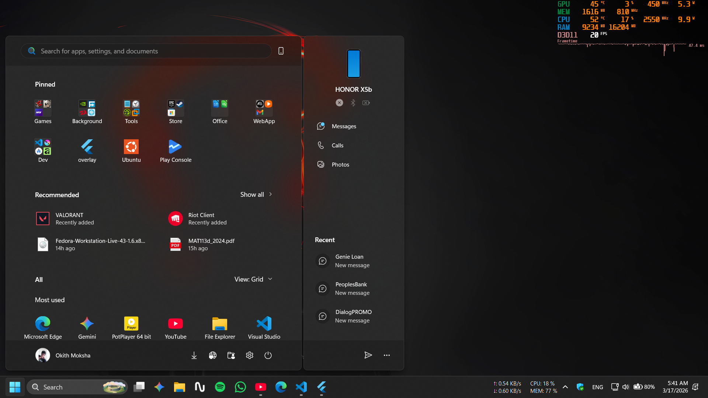

# Overlay

This application provides a transparent, always-on-top window that allows the MSI Afterburner (RTSS) overlay to be visible everywhere on your desktop, not just within games.

## How it Works

By running this frameless, transparent Flutter app with an "always-on-top" priority, MSI Afterburner can hook into its rendering engine. This makes the performance overlay stay visible on top of your desktop and other applications.

## Features

- **Always on Top**: Keeps the overlay visible at all times.
- **Transparent & Frameless**: A minimal footprint that doesn't interfere with your workspace.
- **Mouse Passthrough**: Set to ignore mouse events so you can click through it to the windows behind.

## Download

You can download the latest version from the **Releases** section:
- **[Overlay.zip](https://github.com/OkithM/Afterburner_Overlay/releases)** (Update with actual link if available, or point to the releases tab)

## Getting Started

1. Download and extract `Overlay.zip` from the latest release.
2. Run the executable.
3. Ensure MSI Afterburner / RivaTuner Statistics Server is configured to show the overlay.

## Development

To run this project from source:

1. Clone the repository.
2. Run `flutter pub get`.
3. Run the app with `flutter run`.
